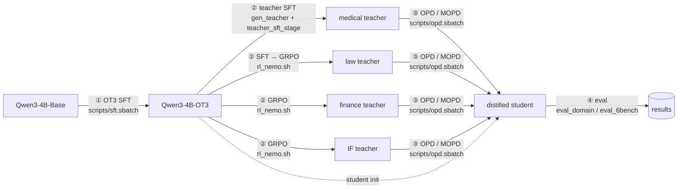

# mopd_sean

**On-policy distillation of domain teachers into a small reasoning student.**
One code base for the whole study: general SFT of Qwen3 base models on OpenThoughts3, domain teachers for
medical / law / finance / instruction-following (SFT distillation and NeMo-RL GRPO), single-teacher OPD and
multi-teacher MOPD on top of trl, and the evaluation harnesses (domain benchmarks + AIME / LiveCodeBench / IFEval / IFBench).

Released models: [huggingface.co/MMOPD](https://huggingface.co/MMOPD) (Qwen3-4B-OT3, Qwen3-1.7B-OT3, and the four 4B domain teachers).



## Layout

```
mopd_sean/
├── mopd/            the package (PYTHONPATH = repo root)
│   ├── common/        chat-format contract · YAML config + --override · resume policy
│   ├── data/          OT3 memmap cache, eval sets, train mixtures · data/domains: RL pools, distillation pools
│   ├── sft/           SFT trainer (OT3 SFT, teacher SFT, warm-ups)
│   ├── teacher/       trace generation (vLLM) · rejection filter · trace selection · weight merge
│   ├── rl/nemo/       NeMo-RL entrypoint + environments (exact-match, IF, code, math-with-judge) · legacy trl GRPO
│   ├── distill/       OPD / MOPD: loss (PG, top-k) · teacher placement · prefill client · trainer · train_opd
│   ├── graders/       math · code · IF · OT3 · sandbox · graders/domains (MedQA, CaseHOLD, FinQA, ...)
│   └── eval/          6-bench runner · eval/domains (sharded vLLM domain eval)
├── scripts/         one launcher per job type (sbatch) + login-node helpers; every one derives REPO from the submit dir
├── configs/         sft/ · rl/ · opd/ · mopd/ (+ variants/ for every ablation, legacy_trl/ for the paper recipe)
├── third_party/     official grader code (vendored) and benchmark clones (rsynced by setup_cluster.sh)
├── tools/           analysis, pool building, report generation, disk and watch helpers (run history, not entrypoints)
├── tests/           CPU tests (loss, placement, teacher client, graders, cache, sandbox canary)
├── docs/            LAYOUT.md (tree and maps) · CONSOLIDATION.md (how the merge was done) · DESIGN, DATA, DATASETS, INFRA ...
├── env/             requirements, container verification, offline assets
└── models/ data/ outputs/ logs/    symlink farms into the asset store, created by setup_cluster.sh
```

## Quick start (cluster)

```bash
cd $S/mopd_sean                      # S = /mnt/datafs/ib-a100-cluster-a-pri/lmalign/personal/sean
source scripts/_common.sh            # REPO, S, IMG, NEMO_IMG, VENV, prefer <n>, JP=k-sean
bash setup_cluster.sh                # symlink farm + offline assets (idempotent)
sbatch -J k-sean-selfcheck $(prefer 1) scripts/selfcheck.sbatch      # imports · CPU tests · config paths
```

Runtime: the team training container + `$S/.venv/mopd` (trl 0.29, vLLM, transformers 4.57) for SFT / OPD / eval, and the
NeMo-RL 0.7 container for RL teachers. Jobs are named `k-sean-*`, placed with `$(prefer N)`, keep every checkpoint,
and report performance at temperature 1.0 (domain benchmarks) or the Qwen3 thinking preset (general benchmarks).

## Recipes

<details>
<summary><b>① General SFT student (Qwen3-*-Base → *-OT3)</b></summary>

```bash
CONFIG=configs/sft/ot3_4b.yaml       sbatch -N 8 -J k-sean-sft-ot3-4b   --cpus-per-task=32 --mem=600G -t 60:00:00 $(prefer 8) scripts/sft.sbatch
CONFIG=configs/sft/ot3_1p7b_18k.yaml sbatch -N 2 -J k-sean-sft-ot3-1p7b --cpus-per-task=32 --mem=600G -t 60:00:00 $(prefer 2) scripts/sft.sbatch
```
Data: OpenThoughts3-1.2M as a packed memmap cache (`mopd.data.prep_openthoughts3`, see docs/OT3_SFT.md).
Resume = resubmit the same line (`train.resume: auto`).
</details>

<details>
<summary><b>② Domain teachers</b></summary>

**SFT distillation from a big teacher** (medical; first stage of law):
```bash
MODEL=$S/past/models/Qwen3.6-35B-A3B POOL=data/distill_pools/med_pool.jsonl TAG=gen-med-35b-k4 K=4 TP=2 \
  sbatch -N 4 -J k-sean-gen-med-35b $(prefer 4) scripts/gen_teacher.sbatch            # traces -> outputs/teacher_gen/<TAG>
bash scripts/teacher_sft_stage.sh gen-med-35b-k4 data/distill_pools/med_pool.jsonl \
  data/sft_distill/med_sft.jsonl configs/sft/distill_med_c6_4ep.yaml 2 4               # verified traces -> SFT
bash scripts/sft_auto_eval.sh distill_med_c6_4ep medqa epochs 4                          # eval each epoch
```
**GRPO with NeMo-RL** (finance, IF, second stage of law):
```bash
CONFIG=configs/rl/grpo_fin.yaml         NODES=4 bash scripts/rl_nemo.sh
CONFIG=configs/rl/grpo_law_distill.yaml NODES=4 bash scripts/rl_nemo.sh
CONFIG=configs/rl/grpo_if.yaml          NODES=4 bash scripts/rl_nemo.sh
CONFIG=configs/rl/grpo_math_v3.yaml     NODES=8 JUDGE=1 bash scripts/rl_nemo.sh          # + 1 judge node
bash scripts/rl_auto_eval.sh rl-fin outputs/rl/grpo_fin_4b models/Qwen3-4B-OT3 finqa 50 100 150 200
```
A NeMo step becomes an HF model dir with `scripts/mk_eval_model.sh`; final teachers are pinned as `models/teacher-{law,fin,if,med}`.
</details>

<details>
<summary><b>③ OPD (one teacher) and MOPD (several teachers)</b></summary>

Same launcher; the config decides (`data.paths` = 1 or N domains, `distill.mode` = pg | topk):
```bash
STUDENT_NODES=1 TEACHERS="med:models/teacher-med" WEIGHTS="med=1.0" CONFIG=configs/opd/med_pg.yaml \
  sbatch -N 2 -J k-sean-opd-med-pg --cpus-per-task=32 --mem=600G -t 48:00:00 $(prefer 2) scripts/opd.sbatch

STUDENT_NODES=2 TEACHERS="law:models/teacher-law,fin:models/teacher-fin,if:models/teacher-if,med:models/teacher-med" \
  WEIGHTS="law=1.0,fin=1.0,if=1.0,med=1.0" CONFIG=configs/mopd/4dom_pg128.yaml \
  sbatch -N 4 -J k-sean-opd-mopd-4dom-128 --cpus-per-task=32 --mem=600G -t 48:00:00 $(prefer 4) scripts/opd.sbatch

setsid nohup bash scripts/auto_eval.sh mopd-4dom-128 dom3 25 50 75 100 125 150 175 200 > logs/auto_eval_mopd-4dom-128.log 2>&1 &
bash scripts/finals.sh mopd-4dom-128          # after opd_done.json: strip optimizer states + final 6-bench
```
Node roles: the first `STUDENT_NODES` nodes train (accelerate, 8 ranks per node, colocated vLLM), the rest serve the
teachers (vLLM prefill, placed by `mopd.distill.placement`). Start from another checkpoint (warm-up, merged teachers):
`bash scripts/opd_from_ckpt.sh configs/opd/med_pg.yaml outputs/sft/<warm-up>/checkpoint-N <run> 2`.
</details>

<details>
<summary><b>④ Evaluation</b></summary>

```bash
MODEL=outputs/opd/<run>/checkpoint-200 TAG=opd-<run>-ck200-dom3-T1 BENCHMARKS=medqa,casehold,finqa \
  sbatch -N 2 -J k-sean-domeval-<tag> $(prefer 2) scripts/eval_domain.sbatch      # T=1.0 -> outputs/eval_domain/<TAG>
MODEL=outputs/opd/<run>/final TAG=full-opd-<run>-final-32k \
  sbatch -N 2 -J k-sean-eval6-<tag> $(prefer 2) scripts/eval_6bench.sbatch        # AIME24-26, LCB v6, IFEval, IFBench
```
Report convention: one model per row, base and teacher rows included, s̃ = mean over domains of (s_d − base) / (teacher − base).
</details>

<details>
<summary><b>Variations</b></summary>

| variation | knob |
|---|---|
| PG vs top-k distillation | `distill.mode: pg` / `topk` + `TOPK=64` or `16` (`configs/opd/*_top64.yaml`, `*_top16.yaml`) |
| prompts per update, per-domain balance | `train.batch_size`, `data.per_domain_per_batch` |
| truncation masking (loop recovery) | `train.mask_truncated_completions: true` |
| student init: SFT warm-up / merged teachers / another run | `scripts/opd_from_ckpt.sh` |
| merged-teacher init | `python -m mopd.teacher.merge_teachers --teachers law=models/teacher-law,... --weights law=0.4,... --base models/Qwen3-4B-OT3 --out models/merged-...` |
| off-policy warm-up from a domain teacher | `gen_teacher.sbatch` → `sft_warmup_stage.sh` → `sft_auto_eval.sh` → `opd_from_ckpt.sh` |
| teacher set and weights | `TEACHERS="dom:path[:tp],..."`, `WEIGHTS="dom=w,..."` (weights drive server placement) |
| RL-only vs SFT+RL teacher | `configs/opd/law_pg_rlteacher.yaml`, `configs/mopd/3dom_rllaw_pg96.yaml` |
| RL teacher recipe | `configs/rl/*.yaml` + `variants/` |
| paper recipe (trl GRPO experts + train_mopd) | `configs/legacy_trl/` + `scripts/legacy/` |
</details>

## Conventions

- Configs: SFT / OPD / MOPD configs use repo-relative paths; NeMo-RL configs use absolute paths (ray workers).
  `python3 scripts/cfgval.py --check-paths` validates every path of every config.
- `models/`, `data/`, `outputs/`, `logs/_orig_*` are symlinks into the asset store: writes go through to the originals.
- Never strip optimizer states of a run that may still resume; never write into `/home/deploy` or `/tmp`.

## How this tree came to be

It merges three working repositories (`mopd`, `mopd_domains`, `mopd_rl`) into one package and one launcher set.
[docs/CONSOLIDATION.md](docs/CONSOLIDATION.md) explains the principles, where every directory came from, the
mechanical rewrites, the handful of real code edits, what each launcher replaced, and the verification;
[docs/LAYOUT.md](docs/LAYOUT.md) is the annotated tree with the module / script / symlink maps; `MAPPING.md` is the
generated file-by-file origin list. Verified 2026-09-14: self-check (imports in both containers, 7 CPU tests, config paths)
and GPU smoke runs of the domain eval, the 6-bench eval and a 2-step OPD job.
